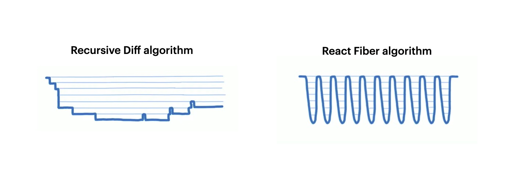
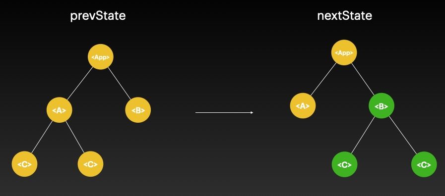
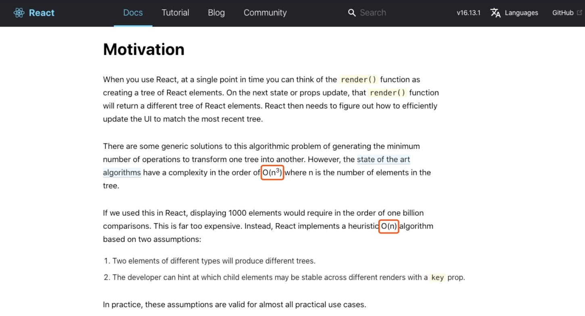
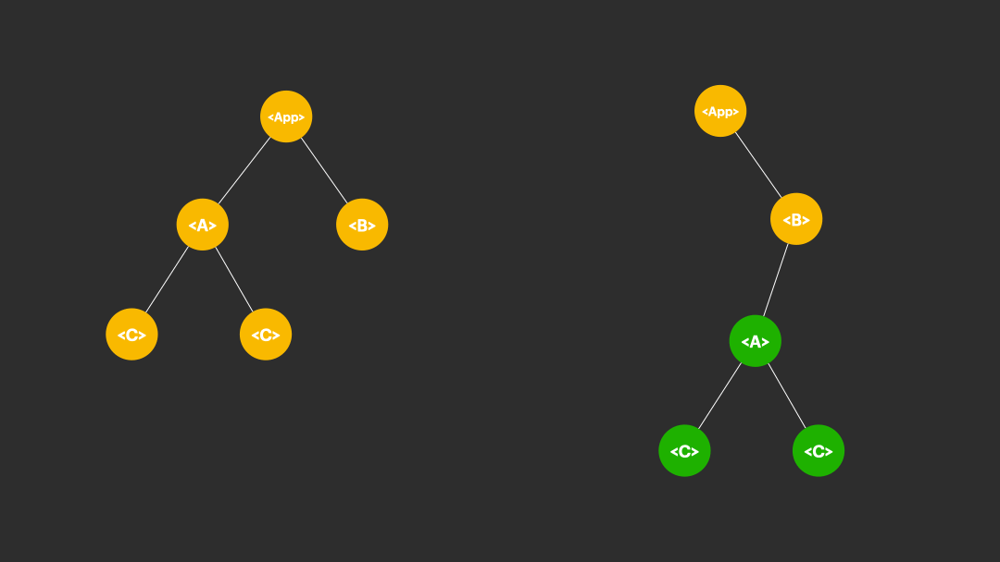
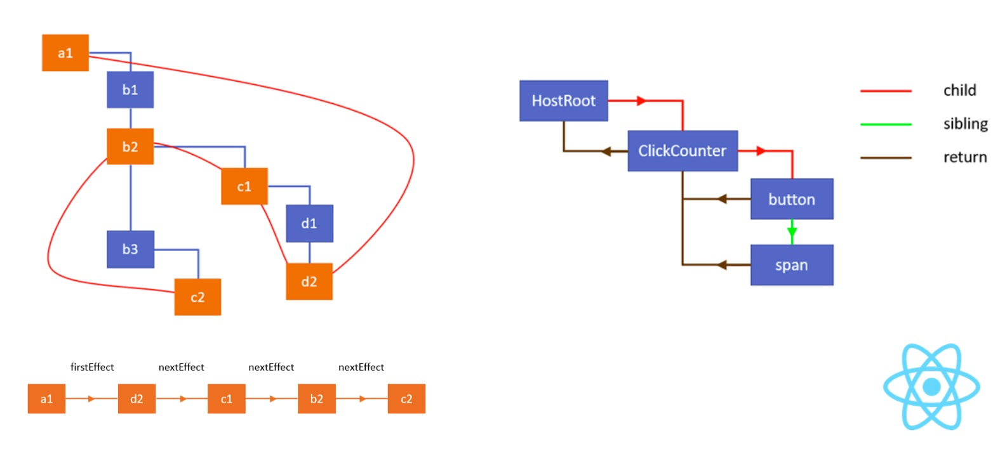

import { ReactFiberStory, MorrisTraversalStory, ConcurrentTraversalStory, DFSTraversalStory } from '@patternize/components';
import BrowserOnly from '@docusaurus/BrowserOnly';

:::info
This blog will explain React Fiber Internal Algorithms, we will:

- Revisit how React diff works
- Problems with Tree Traversal
- Morris Traversal

It's recommended to have a basic understanding of React, virtualDOM, and diff before reading this blog.
:::

You can first experience the difference between React Fiber (v17+) and pre-Fiber (v16) by playing with the playground below:

<BrowserOnly>
{() => (
  <ReactFiberStory />
)}
</BrowserOnly>

You can tell a huge difference between the two versions, the old reconcilor is very slow, but the fiber one is very smooth.

### Diff Calculation of React

React's diff calculation is based on the virtualDOM, which is a tree structure that represents the UI. When a state change happens, React will calculate the difference between the old virtualDOM and the new virtualDOM, and then apply the changes to the realDOM.

However, calculating the edit distance of two unordered trees is NP-Complete, and the standard algorithm needs at least a runtime of **O(n^3)**.

:::tip

There are papers that show that the problem is NP-Complete. Because it is equivalent to a graph isomorphism problem.

:::

React uses a **heuristic approach** that compares nodes level-by-level rather than doing an exhaustive node-by-node comparison. While this may sometimes update more nodes than strictly necessary, it ensures no required updates are missed while being much more efficient than a full tree traversal. The algorithm trades perfect accuracy for speed and predictability.

You can see the heuristic approach of diff traversal in the gif below - **React compares the tree level by level instead of node by node.**

### Problem with Recursion

What’s wrong with doing a full tree traversal for diff in the above animation?

Well, there are two problems with traversing the tree using recursion, we all know in computer science:

1. For any tree recursion, the call stack is O(n)
2. It is impossible to pause the traversal and stop the stack from growing while you are doing recursion.

**Here is an interactive demoof the call stack of the recursion stack:**

<BrowserOnly>
{() => (
  <DFSTraversalStory />
)}
</BrowserOnly>

## Solution to the problems - Morris Traversal

Morris Traversal is a way to traverse a tree without using recursion. It is a linear time algorithm that uses a single stack to store the nodes.

**Here is an interactive slide show of traversing the tree with Morris Traversal:**

<BrowserOnly>
{() => (
  <MorrisTraversalStory />
)}
</BrowserOnly>
 

**With Morris Traversal, the call stack is constant O(1) space. Runtime is O(1) for each evaluation. And you can pause the traversal anytime!**

This is exactly what React Fiber is doing in their code - adding more path between the nodes to turn a tree into a graph like Morris Traversal.

## React Fiber with concurrency

What you can do with fiber once you have O(1) time and space for each evaluation and being able to pause the traversal is concurrent rendering.

This is how React Fiber achieves concurrent rendering, you can see the animation below:

<BrowserOnly>
{() => (
  <ConcurrentTraversalStory />
)}
</BrowserOnly>
