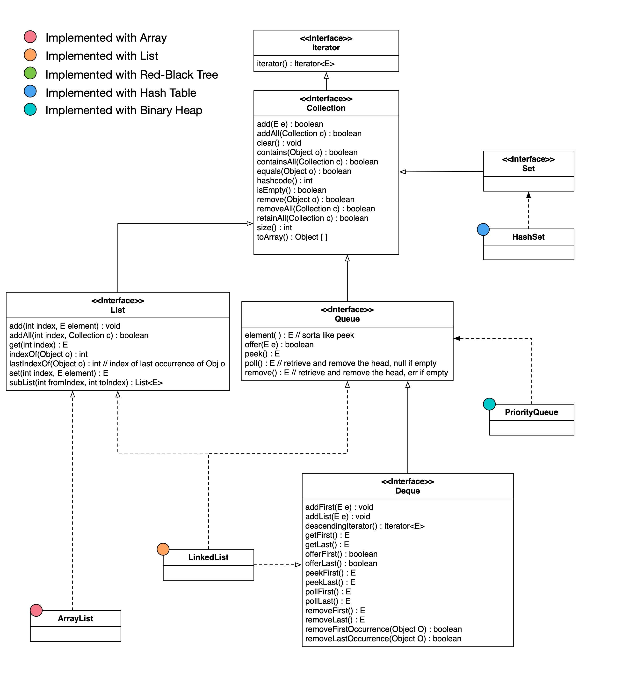
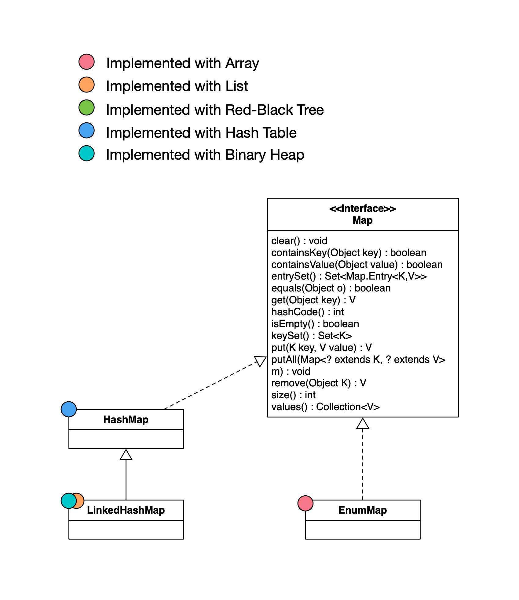

## Major Interfaces
In Java, most of the data structures fall in either `Collection` interface category or `Map` interface category.

### Collection

### Map

## References
 - [Collections In Java](https://www.javatpoint.com/collections-in-java)
 - [Map In Java](https://www.javatpoint.com/java-map)
 - [Visualization Inspiration](http://how2examples.com/java/collections)