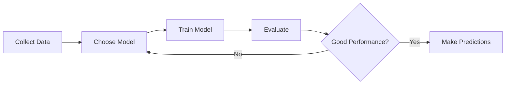

# Supervised Learning

Learn supervised learning algorithms including linear models, decision trees, neural networks, and more. Understand how models learn from labeled data to make predictions.

## What is Supervised Learning?

Supervised learning is a type of machine learning where algorithms learn from **labeled training data** to make predictions or decisions. The "supervised" aspect comes from the fact that we provide the correct answers (labels) during training, allowing the model to learn the relationship between inputs and outputs.

## Formal Definitions

### Hypothesis, Model, and Prediction Function

A **hypothesis** or **model** or **prediction function** is a function $h : \mathcal{X} \rightarrow \mathcal{Y}$ that maps from the input space $\mathcal{X}$ to the output space $\mathcal{Y}$.

### Training Set

A **training set** is a set of pairs $\{(x^{(1)}, y^{(1)}), ..., (x^{(n)}, y^{(n)})\}$ such that $x^{(i)} \in \mathcal{X}$ and $y^{(i)} \in \mathcal{Y}$ for $i \in \{1, ..., n\}$.

The value $n$ is the **training set size**.

### Goal of Learning

**Goal**: Use the training set to find (= **learn**) a *good* model $h$.

- What "good" means is not always easy to define (part of the modeling challenge).
- We will want to use the model $h$ on **new data**, not the training set (**generalization**).

### Problem Types
**If $\mathcal{Y}$ is continuous**, then we call it a **regression** problem.

**If $\mathcal{Y}$ is discrete**, then we call it a **classification** problem (*binary* or *multi-class*).

## The Learning Pipeline

## Topics Covered

import DocCardList from '@theme/DocCardList';

<DocCardList />

