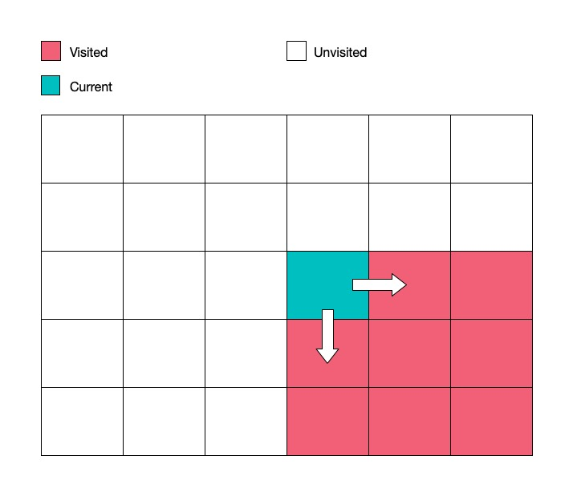

## Introduction

Coordinate-based Dynamic Programming are associated with the coordinates on a array or matrix. You are usually given an array/sequence or a matrix/grid as the input, and the question asks you to find either a subarray, subsequence, vector or path that satisfies a set of conditions. This is one of easier type of Dynamic Programming because it is intuitive to understand.

## Traits
- Usually given an array/sequence or grid/matrix as your input
- Need to find a subsequence/vector/path for
   - maximizing/minimizing a certain property
   - counting
   - true/false
- State Representation:
    - State is usually represented by index (i) or (i, j)
    - is represented by dp[i] and dp[i][j], which are the most optimal solutions for a[i] or a[i][j]
- Transition:
    - Initalization is usually just `dp[0]` with `a[0]` or `a[dp.length-1]` with `a[a.length-1]`
    - At each index i, the most optimal solutions of the surrounding neighbors should be found already
    - Update `dp[i]` or `dp[i,j]` with an aggregate function with the values of its neighbors
