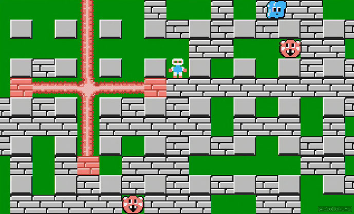

import Tabs from '@theme/Tabs';
import TabItem from '@theme/TabItem';

;

# Question

Original Question: [Leetcode 361. Bomb Enemy](https://leetcode.com/problems/bomb-enemy/)

Given a 2D grid, each cell is either a wall 'W', an enemy 'E' or empty '0' (the number zero), return the maximum enemies you can kill using one bomb.
The bomb kills all the enemies in the same row and column from the planted point until it hits the wall since the wall is too strong to be destroyed.
Note: You can only put the bomb at an empty cell.

### Example:

```
Input: [["0","E","0","0"],["E","0","W","E"],["0","E","0","0"]]
Output: 3 
Explanation: For the given grid,

0 E 0 0 
E 0 W E 
0 E 0 0

Placing a bomb at (1,1) kills 3 enemies.
```

# Solution

<Tabs
defaultValue="java"
values={[
{ label: 'Java', value: 'java', },
{ label: 'Python', value: 'py', },
]
}>
<TabItem value="java">

```java
class Solution {
    public int maxKilledEnemies(char[][] grid) {
        if(grid.length == 0 || grid[0].length == 0) return 0;
        int m = grid.length, n=grid[0].length;
        int[][] up = new int[m][n];
        int[][] down = new int[m][n];
        int[][] left = new int[m][n];
        int[][] right = new int[m][n];
        
        // fill up;
        for(int i = 0; i < m; i++){
           for(int j = 0; j < n; j++){
               if(grid[i][j] == 'W'){
                   up[i][j] = 0;
                   continue;
               }
               
               up[i][j] = grid[i][j] == 'E' ? 1 : 0;
               if(i>0){
                   up[i][j] += up[i-1][j];
               }
           } 
        }
        // fill left;
        for(int i = 0; i < m; i++){
           for(int j = 0; j < n; j++){
               if(grid[i][j] == 'W'){
                   left[i][j] = 0;
                   continue;
               }
               
               left[i][j] = grid[i][j] == 'E' ? 1 : 0;
               if(j>0){
                   left[i][j] += left[i][j-1];
               }
           } 
        }
        
        // fill down;
        for(int i = m-1; i >= 0; i--){
           for(int j = n-1; j >= 0; j--){
               if(grid[i][j] == 'W'){
                   down[i][j] = 0;
                   continue;
               }
               
               down[i][j] = grid[i][j] == 'E' ? 1 : 0;
               if(i < m-1){
                   down[i][j] += down[i+1][j];
               }
           } 
        }
        
        // fill right;
        for(int i = m-1; i >= 0; i--){
           for(int j = n-1; j >= 0; j--){
               if(grid[i][j] == 'W'){
                   right[i][j] = 0;
                   continue;
               }
               
               right[i][j] = grid[i][j] == 'E' ? 1 : 0;
               if(j < n-1){
                   right[i][j] += right[i][j+1];
               }
           } 
        }
        
        int res = 0;
        for(int i = 0; i < m; i++){
            for(int j = 0; j < n; j++){
                if(grid[i][j] == '0'){
                    res = Math.max(res, up[i][j] + down[i][j] + right[i][j] + left[i][j]);
                }
            }
        }
        return res;
    }
}
```

</TabItem>
</Tabs>
