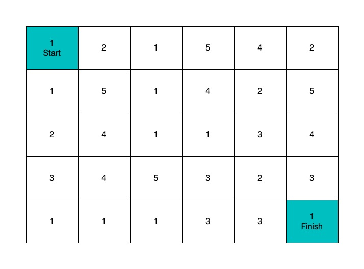

import Tabs from '@theme/Tabs';
import TabItem from '@theme/TabItem';

# Question


Original Question: [Leetcode 64. Minimum Path Sum](https://leetcode.com/problems/minimum-path-sum/)

Given a m x n grid filled with non-negative numbers, find a path from top left to bottom right which minimizes the sum of all numbers along its path.

Note: You can only move either down or right at any point in time.

# Solution

<Tabs
defaultValue="java"
values={[
{ label: 'Java', value: 'java', },
{ label: 'Python', value: 'py', },
]
}>
<TabItem value="java">

```java
class Solution {
    public int minPathSum(int[][] grid) {
        if(grid.length == 0 || grid[0].length == 0) return 0;
        int[][] dp = new int [grid.length][grid[0].length];
        for(int i = 0; i<grid.length; i++){
            for(int j = 0; j < grid[0].length; j++){
                if(i==0 && j==0) dp[i][j] = grid[0][0];
                else if(i==0) {
                    dp[i][j] = grid[i][j] + dp[i][j-1];
                } else if (j == 0){
                    dp[i][j] = grid[i][j] + dp[i-1][j];
                } else {
                    dp[i][j] = grid[i][j] + Math.min(dp[i-1][j], dp[i][j-1]);
                }
            }
        }
        return dp[grid.length-1][grid[0].length-1];
    }
}
```

</TabItem>
<TabItem value="py">

```py
class Solution:
    def minPathSum(self, grid: List[List[int]]) -> int:
        if not grid or not grid[0]:
            return 0

        m,n = len(grid), len(grid[0])


        minSum = [[0 for j in range(n)] for i in range(m) ] 
        minSum[0][0] = grid[0][0]

        for i in range(1,m):
            minSum[i][0] = minSum[i-1][0] + grid[i][0]

        for j in range(1,n):
            minSum[0][j] = minSum[0][j-1] + grid[0][j]

        for i in range(1,m):
            for j in range(1,n):
                minSum[i][j] = min(minSum[i-1][j], minSum[i][j-1]) + grid[i][j]

        return minSum[m-1][n-1]
```
</TabItem>
</Tabs>