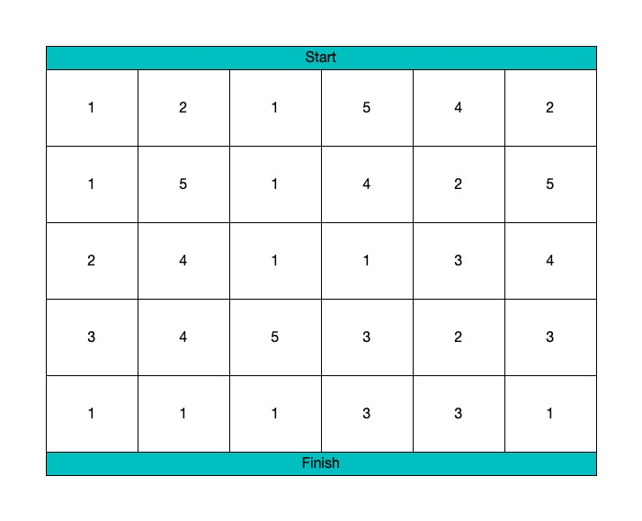

import Tabs from '@theme/Tabs';
import TabItem from '@theme/TabItem';

# Question


Original Question: [931. Minimum Falling Path Sum](https://leetcode.com/problems/minimum-falling-path-sum/)

Given a square array of integers A, we want the minimum sum of a falling path through A.

A falling path starts at any element in the first row, and chooses one element from each row.  The next row's choice must be in a column that is different from the previous row's column by at most one.

# Solution

<Tabs
defaultValue="java"
values={[
{ label: 'Java', value: 'java', },
{ label: 'Python', value: 'py', },
]
}>
<TabItem value="java">

```java
class Solution {
    public int minFallingPathSum(int[][] A) {
        int m = A.length, n = A[0].length;
        int[][] dp = new int[m][n];
        for(int i = 0; i < n; i++){
            dp[0][i] = A[0][i];
        }
        for(int i = 1; i < m; i++){
            for(int j = 0; j < n; j++){
                int topLeft = j-1 < 0 ? Integer.MAX_VALUE : dp[i-1][j-1];
                int topMid = dp[i-1][j];
                int topRight = j+1 >= n ? Integer.MAX_VALUE : dp[i-1][j+1];
                dp[i][j] = A[i][j] + Math.min(topLeft, Math.min(topMid, topRight));
            }
        }
        int smallestPath = Integer.MAX_VALUE;
        for(int i = 0; i < n; i++){
            smallestPath = Math.min(smallestPath, dp[m-1][i]);
        }
        return smallestPath;
    }
}
```

</TabItem>
<TabItem value="py">

```py
class Solution:
    def minFallingPathSum(self, A: List[List[int]]) -> int:
        for i in range(1,len(A)):
            for j in range(len(A[0])):
                if j == 0:
                    A[i][j]  = min((A[i][j] + A[i - 1][j]), (A[i][j] + A[i - 1][j + 1]) )
                elif (j == len(A[0]) - 1):
                    A[i][j]  = min((A[i][j] + A[i - 1][j]), (A[i][j] + A[i - 1][j - 1]) )
                else:
                    A[i][j] = min(A[i][j] + A[i - 1][j],A[i][j] + A[i - 1][j + 1], A[i][j] + A[i - 1][j - 1])
            
        return min(A[len(A) - 1])
```
</TabItem>
</Tabs>